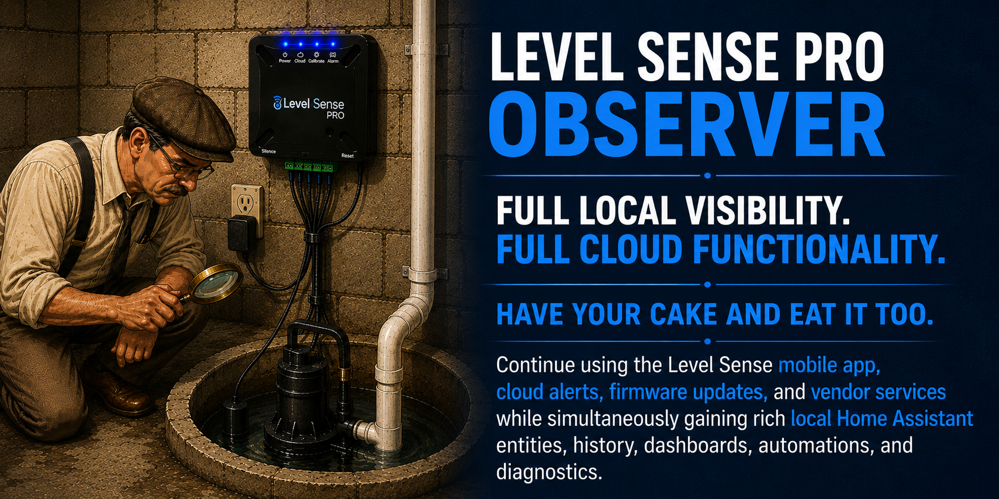

# Level Sense Pro Observer



**Full Local Visibility. Full Cloud Functionality.**

**The Best of Both Worlds!**

Level Sense Pro Observer is a Home Assistant custom integration that
adds detailed local monitoring for a Level Sense Pro while preserving
the manufacturer's cloud service, website, mobile app, alerts, firmware
behavior, and normal device operation.

It does this by acting as a transparent HTTP observer proxy. The Level
Sense Pro still believes it is talking to `cloud.level-sense.com`. The
observer receives the same traffic, decodes useful telemetry for Home
Assistant, then forwards the original request to the real Level Sense
cloud and returns the cloud response to the device.

The goal is simple:

-   Keep the vendor cloud working.
-   Add rich local Home Assistant entities.
-   Do not modify the device, firmware, cloud payload, or cloud
    response.

## Why This Integration Exists

The Level Sense Pro is an excellent cloud connected sump pump monitoring
system, but it has one limitation for Home Assistant users: all of its
rich telemetry is sent only to the vendor cloud.

**Level Sense Pro Observer** solves that problem without sacrificing any
existing functionality.

Rather than replacing the manufacturer's cloud service, the integration
transparently observes the existing HTTP communication, creates native
Home Assistant entities from the telemetry, and then forwards the
original request to the real Level Sense cloud. The original cloud
response is returned unchanged to the device.

The result is the best of both worlds:

-   Native Level Sense mobile app
-   Vendor website
-   Vendor cloud alerts
-   Firmware updates
-   Native Home Assistant entities
-   Dashboards
-   Automations
-   Long-term history
-   Diagnostics

## Quick Start

1.  Install the custom integration.
2.  Configure a DNS rewrite so `cloud.level-sense.com` resolves to Home
    Assistant.
3.  Add the integration from **Settings → Devices & Services**.
4.  Verify the vendor website and Home Assistant are both updating.

For detailed instructions, see **INSTALL.md** and **NETWORK_SETUP.md**.

## Why an Observer?

Unlike many reverse engineering projects, this integration intentionally
**does not replace the manufacturer's cloud**.

Instead, every request is forwarded to the real cloud while Home
Assistant quietly observes the telemetry locally.

This approach preserves normal device operation while adding powerful
local visibility.

## Capability Comparison

| Capability | Vendor Cloud | Local Replacement | Level Sense Pro Observer |
|---|:---:|:---:|:---:|
| Mobile App | ✅ | ❌ | ✅ |
| Vendor Website | ✅ | ❌ | ✅ |
| Cloud Alerts | ✅ | ❌ | ✅ |
| Firmware Updates | ✅ | ❌ | ✅ |
| Home Assistant Entities | ❌ | ✅ | ✅ |
| Local Automations | ❌ | ✅ | ✅ |
| Local History | ❌ | ✅ | ✅ |
| Diagnostics | ❌ | ✅ | ✅ |
## Project Status

-   Production-ready architecture
-   Actively maintained
-   Native Home Assistant config flow
-   Supports Home Assistant diagnostics
-   Designed to preserve vendor cloud functionality

## Highlights

-   Native Home Assistant config flow.
-   Native Home Assistant device.
-   Native sensor and binary sensor entities.
-   Optional raw telemetry sensors.
-   Downloadable diagnostics.
-   Runtime state persistence after Home Assistant restarts.
-   Automatic cloud DNS resolution that bypasses local DNS rewrites.
-   Transparent forwarding to the Level Sense cloud.
-   Vendor website and cloud alerts continue to work.
-   No TLS interception.
-   No firmware modification.
-   No cloud replacement.

## Architecture

``` text
Level Sense Pro
      |
      | DNS lookup for cloud.level-sense.com
      v
Local DNS rewrite, such as AdGuard Home
      |
      | cloud.level-sense.com -> Home Assistant IP
      v
Home Assistant
Level Sense Pro Observer
      |
      | observe, decode, create HA entities
      | forward original request unchanged except required Host routing
      v
Real Level Sense cloud
      |
      | original cloud response
      v
Level Sense Pro Observer
      |
      | return cloud response to the device
      v
Level Sense Pro
```

The observer is intentionally passive. It watches the traffic and
exposes data to Home Assistant, but it does not attempt to replace the
cloud or control the device.

## Local Home Assistant Entities

### Sensors

| Entity | Description |
|---|---|
| Temperature | Corrected average device temperature |
| Humidity | Average humidity |
| Battery Voltage | Average battery voltage |
| RSSI | Average Wi-Fi signal |
| Runtime | Device-reported runtime |
| Packet Count | Number of observed packets |
| Last Seen | Time of the last device packet |
| Cloud Status | HTTP status returned by the Level Sense cloud |
| Cloud Result | Parsed cloud result, such as `success` |
| Cloud Has Config Update | Cloud configuration update flag |
| Cloud Latency | Time to complete the upstream cloud transaction |
### Binary Sensors

| Entity | Description |
|---|---|
| Relay State | Raw relay state exposed as a binary sensor |
| Siren State | Raw siren state exposed as a binary sensor |
| Device State | Raw device state exposed as a binary sensor |
| Alarm Silence | Alarm silence state |
| Debug Mode | Debug mode when reported by firmware |
### Optional raw telemetry sensors

When enabled, the integration can also create raw entities for each
telemetry channel, such as:

-   Raw temperature channels.
-   Raw humidity channels.
-   Raw battery channels.
-   Raw RSSI channels.
-   Raw capacitive sense channels.
-   Raw inputs.
-   Raw device flags.

Raw sensors are disabled by default because most users only need the
polished entities.


## Complete Entity Reference

The integration creates a focused set of normal entities by default. Optional
raw telemetry entities can be enabled from the integration options when deeper
protocol visibility or troubleshooting is needed.

Many numeric telemetry fields arrive as three-value groups. Based on repeated
observations, the values follow this pattern:

1. Current or most recent value.
2. Minimum value observed during the device reporting interval.
3. Maximum value observed during the device reporting interval.

The reporting interval is normally about two minutes, but it can vary slightly.
These meanings are based on observed device behavior rather than published
vendor protocol documentation.

### Standard Sensors

| Entity ID | Typical Value | Description |
|---|---|---|
| `sensor.level_sense_pro_temperature` | 40-100 °F | Corrected ambient temperature. The integration averages the three raw temperature channels and compensates for the observed internal temperature offset before exposing the value. |
| `sensor.level_sense_pro_humidity` | 0-100 %RH | Average relative humidity reported by the device. |
| `sensor.level_sense_pro_battery_voltage` | About 3.5-4.2 V | Average internal backup-battery voltage. Useful for battery-health monitoring. |
| `sensor.level_sense_pro_rssi` | About -30 to -90 dBm | Average Wi-Fi signal strength. Higher, less-negative values indicate a stronger connection. |
| `sensor.level_sense_pro_runtime` | Seconds | Device-reported runtime counter. Observed behavior is consistent with elapsed device runtime since startup. |
| `sensor.level_sense_pro_packet_count` | Increasing integer | Number of telemetry packets successfully processed by the Observer. The value is persisted across Home Assistant restarts. |
| `sensor.level_sense_pro_last_seen` | Timestamp | Time the most recent telemetry packet was received from the Level Sense Pro. |
| `sensor.level_sense_pro_cloud_status` | Usually `200` | HTTP status returned by the vendor cloud after the Observer forwards the device request. |
| `sensor.level_sense_pro_cloud_result` | `success` / `fail` | Parsed `result` value returned by the vendor cloud. |
| `sensor.level_sense_pro_cloud_has_config_update` | `0` / `1` | Vendor-cloud flag indicating whether a configuration update is waiting for the device. |
| `sensor.level_sense_pro_cloud_latency` | Milliseconds | Time required to connect to the upstream vendor cloud, send the request, and receive the complete framed HTTP response. |

### Binary Sensors

| Entity ID | Typical Value | Description |
|---|---|---|
| `binary_sensor.level_sense_pro_relay_state` | on / off | Internal dry-contact relay output state. This is not the sump-pump motor state. |
| `binary_sensor.level_sense_pro_siren_state` | on / off | Internal audible-alarm state. |
| `binary_sensor.level_sense_pro_device_state` | on / off | Device status or fault flag. Zero has been observed during normal operation, but the full vendor meaning is not yet documented. |
| `binary_sensor.level_sense_pro_alarm_silence` | on / off | Indicates whether the device alarm has been silenced. |
| `binary_sensor.level_sense_pro_debug_mode` | on / off / unknown | Firmware debug-mode flag when reported by the device. |

### Optional Raw Telemetry Sensors

Raw telemetry sensors are disabled by default. They expose the values exactly as
reported by the device, without the averaging and presentation applied to the
standard entities.

| Entity ID | Typical Value | Description |
|---|---|---|
| `sensor.level_sense_pro_raw_sample_elapsed_ms` | About 120000-140000 ms | Raw elapsed time associated with the reporting sample. |
| `sensor.level_sense_pro_raw_run_t` | Seconds | Raw device runtime counter. |
| `sensor.level_sense_pro_raw_relay_state` | `0` / `1` | Raw relay output flag. |
| `sensor.level_sense_pro_raw_device_state` | `0` or higher | Raw device-status field. Zero has been observed during normal operation. |
| `sensor.level_sense_pro_raw_siren_state` | `0` / `1` | Raw siren-state flag. |
| `sensor.level_sense_pro_raw_alarm_silence` | `0` / `1` | Raw alarm-silence flag. |
| `sensor.level_sense_pro_raw_cap_sense_1` | About 400-900 | Current capacitive water-level probe reading. |
| `sensor.level_sense_pro_raw_cap_sense_2` | Similar | Minimum capacitive reading observed during the reporting interval. |
| `sensor.level_sense_pro_raw_cap_sense_3` | Similar | Maximum capacitive reading observed during the reporting interval. |
| `sensor.level_sense_pro_raw_cycle_count_1` | Integer | Current cycle-counter value. The exact vendor-defined purpose of the counter is not yet known. |
| `sensor.level_sense_pro_raw_cycle_count_2` | Integer | Minimum cycle-counter value observed during the reporting interval. |
| `sensor.level_sense_pro_raw_cycle_count_3` | Integer | Maximum cycle-counter value observed during the reporting interval. |
| `sensor.level_sense_pro_raw_temperature_c_1` | Temperature | Current uncorrected temperature reading. Home Assistant may display it using the system's configured temperature unit. |
| `sensor.level_sense_pro_raw_temperature_c_2` | Temperature | Minimum uncorrected temperature observed during the reporting interval. |
| `sensor.level_sense_pro_raw_temperature_c_3` | Temperature | Maximum uncorrected temperature observed during the reporting interval. |
| `sensor.level_sense_pro_raw_humidity_1` | 0-100 %RH | Current raw humidity reading. |
| `sensor.level_sense_pro_raw_humidity_2` | 0-100 %RH | Minimum humidity observed during the reporting interval. |
| `sensor.level_sense_pro_raw_humidity_3` | 0-100 %RH | Maximum humidity observed during the reporting interval. |
| `sensor.level_sense_pro_raw_battery_vdc_1` | About 3.5-4.2 V | Current backup-battery voltage. |
| `sensor.level_sense_pro_raw_battery_vdc_2` | Similar | Minimum battery voltage observed during the reporting interval. |
| `sensor.level_sense_pro_raw_battery_vdc_3` | Similar | Maximum battery voltage observed during the reporting interval. |
| `sensor.level_sense_pro_raw_input_1_1` | About 1400 when inactive | Current analog reading for device Input 1. The attached accessory depends on device wiring and configuration. |
| `sensor.level_sense_pro_raw_input_1_2` | Similar | Minimum Input 1 reading observed during the reporting interval. |
| `sensor.level_sense_pro_raw_input_1_3` | Similar | Maximum Input 1 reading observed during the reporting interval. |
| `sensor.level_sense_pro_raw_input_2_1` | About 1400 when inactive | Current analog reading for device Input 2. The attached accessory depends on device wiring and configuration. |
| `sensor.level_sense_pro_raw_input_2_2` | Similar | Minimum Input 2 reading observed during the reporting interval. |
| `sensor.level_sense_pro_raw_input_2_3` | Similar | Maximum Input 2 reading observed during the reporting interval. |
| `sensor.level_sense_pro_raw_rssi_1` | About -30 to -90 dBm | Current Wi-Fi RSSI. |
| `sensor.level_sense_pro_raw_rssi_2` | Similar | Minimum RSSI observed during the reporting interval. This is the weakest signal sample. |
| `sensor.level_sense_pro_raw_rssi_3` | Similar | Maximum RSSI observed during the reporting interval. This is the strongest signal sample. |

### HACS Update Entity

When the integration is installed through HACS, HACS may also create:

| Entity ID | Description |
|---|---|
| `update.level_sense_pro_observer_update` | Indicates whether a newer integration release is available through HACS. This entity is provided by HACS, not by the integration itself. |
## Installation

See [INSTALL.md](INSTALL.md) for detailed installation and verification
instructions.

## Network setup

A DNS rewrite is required so the Level Sense Pro sends its cloud traffic
to Home Assistant first.

See [NETWORK_SETUP.md](NETWORK_SETUP.md) for AdGuard Home, Pi-hole, and
general DNS rewrite guidance.

## Design philosophy

Level Sense Pro Observer is designed around a simple principle:

**Preserve cloud functionality while adding local visibility.**

This is not a cloud replacement. It is not a firmware modification. It
is not a device emulator. It is a transparent observer.

See [DESIGN.md](DESIGN.md) for the full architecture and rationale.

## Diagnostics

Home Assistant's built-in diagnostics download includes:

-   Integration configuration.
-   Current device telemetry.
-   Network metadata.
-   Cloud response data.
-   DNS resolver state.
-   Packet statistics.
-   Unknown protocol fields.
-   Last raw payload.

This makes troubleshooting easier without requiring packet captures for
normal issues.

## Requirements

-   Home Assistant.
-   A Level Sense Pro that communicates with `cloud.level-sense.com`
    over HTTP.
-   A DNS rewrite tool such as AdGuard Home, Pi-hole, pfSense, OPNsense,
    UniFi DNS, MikroTik, Technitium DNS, or similar.
-   Network routing/firewall rules that allow the Level Sense Pro to
    reach Home Assistant on the configured listen port.

## Important notes

-   This integration currently observes HTTP traffic on port 80.
-   If the vendor moves this device to HTTPS in the future, the
    architecture would need to change.
-   This integration is independent and is not affiliated with, endorsed
    by, or sponsored by Level Sense.
-   Level Sense is a trademark of its respective owner.

## Supported DNS Platforms

Any DNS server capable of rewriting a hostname may be used, including:

-   AdGuard Home
-   Pi-hole
-   Technitium DNS
-   pfSense
-   OPNsense
-   MikroTik
-   UniFi DNS

## What This Integration Does Not Do

-   Replace the Level Sense cloud
-   Modify device firmware
-   Require hardware modifications
-   Intercept HTTPS traffic
-   Require inbound firewall ports
-   Modify telemetry before forwarding it

## Support

When opening an issue, please include:

-   Home Assistant version
-   Integration version
-   Downloaded diagnostics file
-   Relevant Home Assistant log entries
-   A description of the observed behavior

This information usually allows problems to be diagnosed without
requiring packet captures.

## Roadmap

See [ROADMAP.md](ROADMAP.md).

## Changelog

See [CHANGELOG.md](CHANGELOG.md).

## License

This project is licensed under the MIT License. See [LICENSE](LICENSE).
